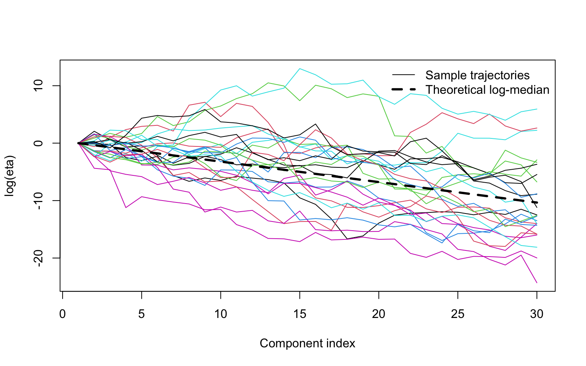

<!-- README.md is generated from README.Rmd. Please edit README.Rmd -->

# mhcp

<!-- badges: start -->
<!-- badges: end -->

**mhcp** is an R package for simulation, probabilistic calibration, and
effective-dimension analysis of the **Multiplicative Half-Cauchy Process
(MHCP)**.

The MHCP is an ordered shrinkage process with half-Cauchy multiplicative
increments. When `0 < zeta < 1`, trajectories shrink toward zero almost
surely while still allowing occasional large local excursions.

The package accompanies the manuscript:

> **Pathwise Shrinkage and Probabilistic Calibration of the
> Multiplicative Half-Cauchy Process**  
> Siddhesh Kulkarni (2026)

## Installation

Install the development version from GitHub:

``` r
# install.packages("remotes")
remotes::install_github("SiddheshKulkarni-source/mhcp")
```

Then load the package:

``` r
library(mhcp)
```

## Quick start

### Simulate the process

Generate five independent MHCP trajectories with 20 ordered components:

``` r
set.seed(123)

eta <- rmhcp(
  n = 5,
  d = 20,
  zeta = 0.7
)

round(eta[, 1:6], 3)
```

    ##      eta_1 eta_2 eta_3  eta_4  eta_5  eta_6
    ## [1,]     1 0.888 0.090  0.009  0.002  0.000
    ## [2,]     1 0.549 4.341 20.578 14.055 14.206
    ## [3,]     1 2.381 0.586  0.657  0.061  0.091
    ## [4,]     1 0.270 1.157  3.488  4.068  0.051
    ## [5,]     1 0.132 0.676  0.159  0.016  0.021

The first component is fixed at 1. Subsequent components evolve
multiplicatively.

For long trajectories, simulation can also be performed directly on the
log scale:

``` r
log_eta <- rmhcp(
  n = 5,
  d = 20,
  zeta = 0.7,
  log = TRUE
)
```

## Probabilistic calibration

A main feature of `mhcp` is probability-based calibration of the
shrinkage parameter `zeta`.

Suppose we want the 10th component to be below `0.05` with 90% prior
probability.

``` r
cal <- calibrate_mhcp(
  H = 10,
  epsilon = 0.05,
  p = 0.90
)

cal
```

    ##    H epsilon   p        q     zeta method
    ## 1 10    0.05 0.9 5.966875 0.369411  exact

This gives approximately:

``` text
zeta = 0.369
```

In other words, this value of `zeta` is chosen so that

``` text
P(eta_10 <= 0.05) = 0.90.
```

We can verify the calibration directly:

``` r
pmhcp(
  x = 0.05,
  H = 10,
  zeta = cal$zeta
)
```

    ## [1] 0.9

The result should be close to `0.90`.

This allows users to specify an interpretable prior statement rather
than selecting `zeta` through trial and error.

## Local excursions

Although the process shrinks globally when `zeta < 1`, individual
components do not have to decrease monotonically.

The probability that the next component exceeds `c` times the current
component can be calculated directly:

``` r
mhcp_excursion_prob(
  zeta = 0.7,
  c = c(1, 2, 5)
)
```

    ## [1] 0.38880022 0.21433385 0.08855123

For `zeta = 0.7`, the probability of an immediate increase is about
`0.389`.

Thus, the MHCP combines **global shrinkage with local flexibility**.

## Effective dimension

For a threshold `epsilon`, define the effective dimension as the number
of components whose scale exceeds that threshold.

The expected effective dimension can be calculated using:

``` r
eff <- expected_mhcp_dimension(
  zeta = cal$zeta,
  epsilon = 0.05
)

eff$mean_effective_dimension
```

    ## [1] 4.752268

For the calibration above, the expected effective dimension is
approximately:

``` text
4.75
```

This connects a local probability statement about a selected component
to the overall complexity implied by the shrinkage process.

## Visualizing trajectories

The following example shows several trajectories on the log scale.

``` r
set.seed(123)

sim <- rmhcp(
  n = 25,
  d = 30,
  zeta = 0.7,
  log = TRUE
)

h <- seq_len(ncol(sim))

matplot(
  h,
  t(sim),
  type = "l",
  lty = 1,
  xlab = "Component index",
  ylab = "log(eta)"
)

lines(
  h,
  (h - 1) * log(0.7),
  lwd = 3,
  lty = 2
)

legend(
  "topright",
  legend = c(
    "Sample trajectories",
    "Theoretical log-median"
  ),
  lty = c(1, 2),
  lwd = c(1, 3),
  bty = "n"
)
```



The individual trajectories can fluctuate substantially, while their
long-run behavior is governed by the shrinkage parameter `zeta`.

## Main functions

| Function                    | Purpose                                                |
|:----------------------------|:-------------------------------------------------------|
| `rmhcp()`                   | Simulate MHCP trajectories                             |
| `pmhcp()`                   | Evaluate the distribution of a selected component      |
| `pmhcp_centered()`          | Evaluate the centered log-process CDF                  |
| `qmhcp_centered()`          | Compute centered log-process quantiles                 |
| `calibrate_mhcp()`          | Calibrate `zeta` from a probability statement          |
| `mhcp_excursion_prob()`     | Calculate local excursion probabilities                |
| `expected_mhcp_dimension()` | Calculate expected threshold-based effective dimension |

For example:

``` r
?rmhcp
?calibrate_mhcp
?expected_mhcp_dimension
```

## Reproducing the worked example

The main calibration example can be reproduced with:

``` r
result <- calibrate_mhcp(
  H = 10,
  epsilon = 0.05,
  p = 0.90
)

result
```

    ##    H epsilon   p        q     zeta method
    ## 1 10    0.05 0.9 5.966875 0.369411  exact

``` r
expected_mhcp_dimension(
  zeta = result$zeta,
  epsilon = 0.05
)$mean_effective_dimension
```

    ## [1] 4.752268

The expected results are approximately:

``` text
zeta             = 0.3694
P(eta_10 <= .05) = 0.90
E(N_0.05)        = 4.75
```

## Citation

If you use `mhcp` in research, please cite:

> Kulkarni, S. (2026). *Pathwise Shrinkage and Probabilistic Calibration
> of the Multiplicative Half-Cauchy Process*. Manuscript in preparation.

You can also obtain the package citation from R:

``` r
citation("mhcp")
```

The citation information will be updated when the accompanying article
receives its final bibliographic information.

## Development status

`mhcp` is currently under active development.

Version `0.1.0` focuses on simulation, probabilistic calibration, local
excursion probabilities, and threshold-based effective-dimension
analysis.

## License

MIT
